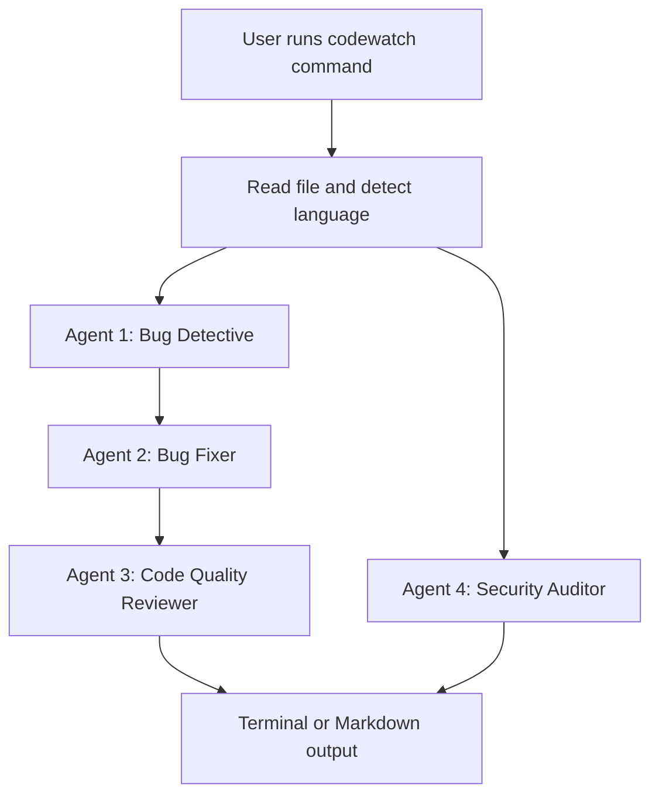

# FiXr

[](https://nodejs.org/)
[](https://www.typescriptlang.org/)
[](LICENSE)

FiXr is a multi-agent AI code analysis CLI that reviews source files with a structured pipeline focused on bug detection, automated remediation, code quality scoring, and security auditing.

Built for terminal-first workflows, FiXr helps engineering teams standardize code review quality and accelerate feedback loops without leaving the command line.

## Product Preview


## Table of Contents

- [Why FiXr](#why-fixr)
- [How It Works](#how-it-works)
- [Core Capabilities](#core-capabilities)
- [Agent Responsibilities](#agent-responsibilities)
- [Installation](#installation)
- [Environment Setup and Model Providers](#environment-setup-and-model-providers)
- [Command Reference](#command-reference)
- [Configuration](#configuration)
- [Supported Languages](#supported-languages)
- [Project Structure](#project-structure)
- [Development](#development)
- [Sample Output](#sample-output)
- [License](#license)

## Why FiXr

Traditional code review flows are often fragmented across IDE plugins, chat tools, and manual checks. FiXr provides one deterministic CLI workflow that:

- Inspects code through multiple focused AI perspectives
- Generates machine-readable and human-readable outputs
- Supports selective agent execution for cost and speed control
- Integrates cleanly into local development and git-based workflows

## How It Works

FiXr uses a sequential pipeline and a shared `PipelineContext` object. Each stage enriches context and hands it off to the next stage.



Pipeline behavior:

- The Bug Fixer consumes findings generated by the Bug Detective.
- The Code Quality Reviewer evaluates the fixed code version.
- The Security Auditor independently scans the original input.

## Core Capabilities

| Capability | Description |
|---|---|
| Single-file analysis | Analyze one file with `codewatch analyze <file>` |
| Watch mode | Continuously analyze changed files using debounced file watching |
| Git diff scanning | Analyze only changed files from your current git working tree |
| Selective execution | Run a subset of agents via `--agents` |
| Report export | Save markdown reports using `--output` |
| Model override | Switch models per run using `--model` |
| Config discovery | Load project config via Cosmiconfig (`.codewatchrc*`, config file, or `package.json`) |

## Agent Responsibilities

### Agent 1: Bug Detective

Detects runtime and logic defects such as null/undefined access, boundary issues, async misuse, and common correctness failures. Findings are categorized by severity.

### Agent 2: Bug Fixer

Generates a corrected code version from Agent 1 findings. Resolved items are marked with `// FIXED:`; uncertain cases are marked for manual follow-up.

### Agent 3: Code Quality Reviewer

Evaluates maintainability and readability, including naming quality, structure, complexity, and potential performance concerns. Produces both a rating and a score.

### Agent 4: Security Auditor

Performs security-focused static review against risks such as injection vectors, weak validation, hardcoded secrets, path traversal, and other OWASP-aligned issues.

## Installation

### Prerequisites

- Node.js 18 or later
- An API key for your preferred LLM provider

### Setup

```bash
git clone https://github.com/soumyachk101/FiXr.git
cd FiXr
npm install
npm run build
npm link
```

After linking, the CLI command becomes available as:

```bash
codewatch <command> [options]
```

## Environment Setup and Model Providers

FiXr supports Anthropic models directly and OpenAI-compatible providers through `fetch`.

Create a `.env` file in the project root:

### Anthropic (default)

```env
ANTHROPIC_API_KEY=your-anthropic-key
```

### OpenAI

```env
OPENAI_API_KEY=your-openai-key
```

Run with an OpenAI model:

```bash
codewatch analyze src/index.ts --model gpt-4o
```

### Other OpenAI-Compatible Providers

Set both key and base URL:

```env
OPENAI_API_KEY=your-provider-key
OPENAI_API_BASE=https://provider-endpoint.example.com/v1
```

Provider examples:

- DeepSeek: `https://api.deepseek.com`
- Groq: `https://api.groq.com/openai/v1`
- Local Ollama: `http://localhost:11434/v1`

### Rate Limit Handling

For OpenAI-compatible endpoints, FiXr includes:

- Retry support for HTTP 429 responses (up to 3 attempts)
- Wait-time extraction from provider messages when available
- Exponential backoff fallback when no structured timing is provided

## Command Reference

FiXr can be invoked globally, via npm, or through the built artifact.

- Global: `codewatch <command> [options]`
- npm: `npm start -- <command> [options]`
- Node: `node dist/index.js <command> [options]`

### `analyze <file>`

Analyze one file through the full pipeline (or selected agents).

```bash
codewatch analyze <file-path> [options]
```

Options:

| Option | Short | Description |
|---|---|---|
| `--output <path>` | `-o` | Save markdown report to file |
| `--agents <list>` | `-a` | Comma-separated values: `bug`, `fixer`, `quality`, `security` |
| `--model <model>` | `-m` | Override model for this run |

Examples:

```bash
codewatch analyze src/index.ts
codewatch analyze src/api/claude.ts --agents bug,security
codewatch analyze scripts/process.py -m llama-3.3-70b-versatile -o reports/process-report.md
```

### `watch [dir]`

Watch a directory and analyze files automatically on changes.

```bash
codewatch watch [directory-path]
```

Behavior:

- Defaults to `.` when directory is omitted
- Debounced runs (default: `2000ms`) to reduce duplicate processing
- Ignores `node_modules`, `dist`, `.git`, and configured ignore patterns

### `diff`

Analyze files changed in the current git working tree.

```bash
codewatch diff [options]
```

Options:

| Option | Short | Description |
|---|---|---|
| `--agents <list>` | `-a` | Select agents |
| `--model <model>` | `-m` | Override model |

Example:

```bash
codewatch diff --model llama-3.3-70b-versatile
```

## Configuration

FiXr uses Cosmiconfig and resolves config from:

- `.codewatchrc.json`
- `.codewatchrc.yaml`
- `codewatch.config.js`
- `codewatch` key in `package.json`

Default shape:

```json
{
  "agents": ["bug", "fixer", "quality", "security"],
  "ignore": ["node_modules", "dist", "*.test.js", ".git"],
  "watch": {
    "extensions": [".js", ".ts", ".py", ".go"],
    "debounce": 2000
  },
  "output": {
    "format": "terminal",
    "saveReport": false,
    "reportPath": "./reports"
  },
  "model": "claude-3-5-sonnet-20240620",
  "maxTokens": 2000
}
```

## Supported Languages

File extensions currently mapped:

| Extension | Language |
|---|---|
| `.js` | JavaScript |
| `.ts` | TypeScript |
| `.py` | Python |
| `.go` | Go |
| `.java` | Java |
| `.cpp` | C++ |
| `.c` | C |
| `.rb` | Ruby |
| `.php` | PHP |
| `.rs` | Rust |

## Project Structure

```text
FiXr/
├── src/
│   ├── index.ts
│   ├── api/
│   │   └── claude.ts
│   ├── agents/
│   │   ├── types.ts
│   │   ├── pipeline.ts
│   │   ├── bugDetective.ts
│   │   ├── bugFixer.ts
│   │   ├── codeQuality.ts
│   │   └── securityAudit.ts
│   ├── commands/
│   │   ├── analyze.ts
│   │   ├── watch.ts
│   │   └── diff.ts
│   ├── config/
│   │   └── loader.ts
│   └── output/
│       ├── terminal.ts
│       └── markdown.ts
├── package.json
└── tsconfig.json
```

## Development

```bash
npm run watch
npm run build
npm start
```

## Sample Output

```text
━━━━━━━━━━━━━━━━━━━━━━━━━━━━━━━━━━━━━━━━
CodeWatch — Multi-Agent Analysis
File: src/app.ts
━━━━━━━━━━━━━━━━━━━━━━━━━━━━━━━━━━━━━━━━

BUG DETECTIVE
  [HIGH] Line 23 — missing null check before user.name
  [MEDIUM] Line 45 — possible off-by-one in loop boundary

BUG FIXER
  - Added null guard before user.name on line 23
  - Corrected loop termination condition on line 45

CODE QUALITY
  Rating: GOOD (78/100)
  - processData is too long (87 lines); consider extraction

SECURITY AUDITOR
  [CRITICAL] Line 34 — SQL injection risk in raw query construction

━━━━━━━━━━━━━━━━━━━━━━━━━━━━━━━━━━━━━━━━
Score: 78/100 | Issues: 3
━━━━━━━━━━━━━━━━━━━━━━━━━━━━━━━━━━━━━━━━
```

## License

ISC
