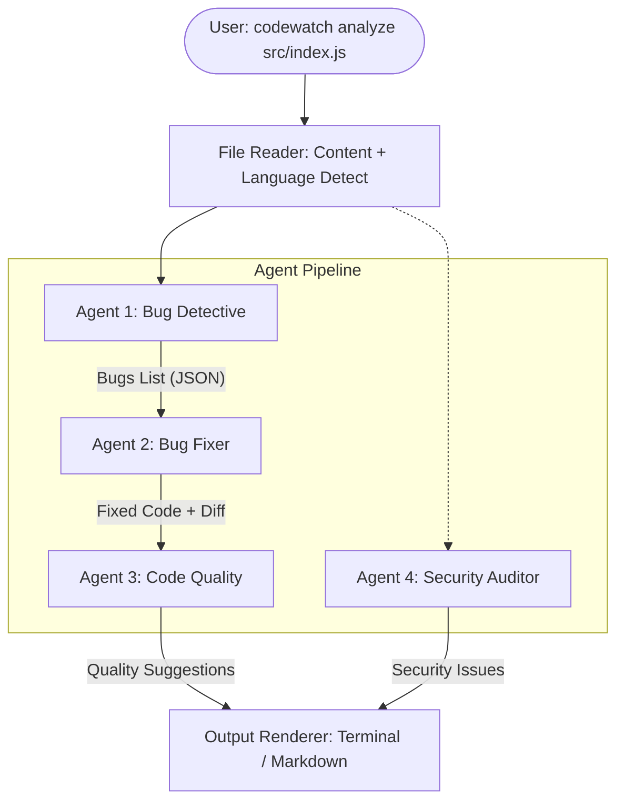

# CodeWatch — Multi-Agent Code Analysis CLI

CodeWatch is a powerful CLI tool designed to integrate seamlessly into any developer's workflow. It automatically analyzes your code using a pipeline of four specialized AI agents to find bugs, suggest fixes, improve code quality, and audit security—without the need for manual copy-pasting.

## 🚀 Vision

To provide a zero-friction, IDE-agnostic AI code review pipeline that gives developers fast, high-quality feedback directly in their terminal.

---

## 📊 Workflow Architecture

CodeWatch uses a sequential multi-agent pipeline where the output of one agent informs the next.



---

## ✨ Features

- **F1 — Single File Analysis**: Analyze any file instantly.
- **F2 — Folder Watch**: Automatically analyze files on save.
- **F3 — Git Diff Analysis**: Analyze only the files changed in your current branch.
- **F4 — Markdown Reports**: Save detailed analysis reports for later review.
- **F5 — Selective Agents**: Run only the agents you need (e.g., just security and bugs).

---

## 🛠️ The 4 Specialized Agents

| Agent | Name | Responsibility |
|-------|------|----------------|
| **Agent 1** | 🐛 Bug Detective | Logic errors, null checks, edge cases, and typos. |
| **Agent 2** | 🔧 Bug Fixer | Generates fixed code based on Detective's findings. |
| **Agent 3** | ✨ Code Quality | Readability, structure, naming, and best practices. |
| **Agent 4** | 🔒 Security Auditor | XSS, injection, exposed secrets, and insecure deps. |

---

## 📦 Installation

```bash
# Install globally
npm install -g codewatch

# Set your Anthropic API Key
export ANTHROPIC_API_KEY='your-api-key-here'
```

---

## 📖 Usage

### Analyze a single file
```bash
codewatch analyze src/index.js
```

### Watch a folder for changes
```bash
codewatch watch ./src
```

### Analyze files changed in Git
```bash
codewatch diff
```

### Options
- `--output report.md`: Save the output to a Markdown file.
- `--agents bug,security`: Run specific agents.
- `--model claude-3-5-sonnet-20240620`: Specify the AI model.

---

## ⚙️ Configuration

Create a `.codewatchrc.json` in your project root:

```json
{
  "agents": ["bug", "fixer", "quality", "security"],
  "ignore": ["node_modules", "dist", "*.test.js"],
  "watch": {
    "extensions": [".js", ".ts", ".py", ".go"],
    "debounce": 2000
  },
  "output": {
    "format": "terminal",
    "saveReport": false,
    "reportPath": "./reports"
  },
  "model": "claude-3-5-sonnet-20240620",
  "maxTokens": 2000
}
```

---

## 🏗️ Technical Stack

- **Runtime**: Node.js
- **Language**: TypeScript
- **AI Engine**: Anthropic Claude API
- **CLI Framework**: Commander.js
- **File Watching**: Chokidar
- **UI**: Chalk & Ora

---

## 📈 Performance Targets

| Metric | Target |
|--------|--------|
| Analysis Time | < 30 seconds |
| Memory Usage | < 100 MB |
