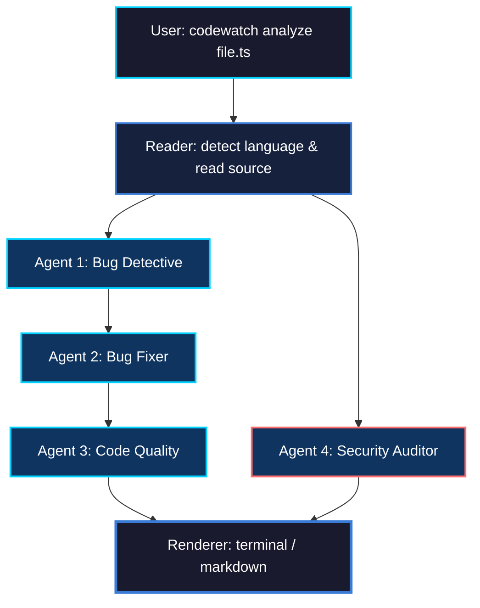
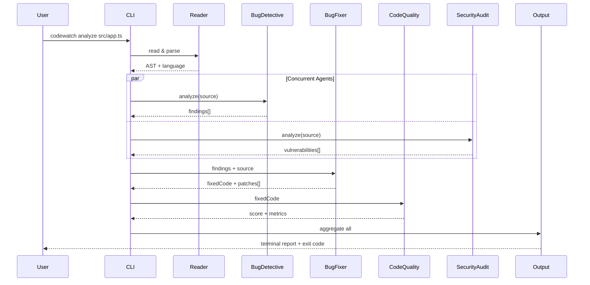
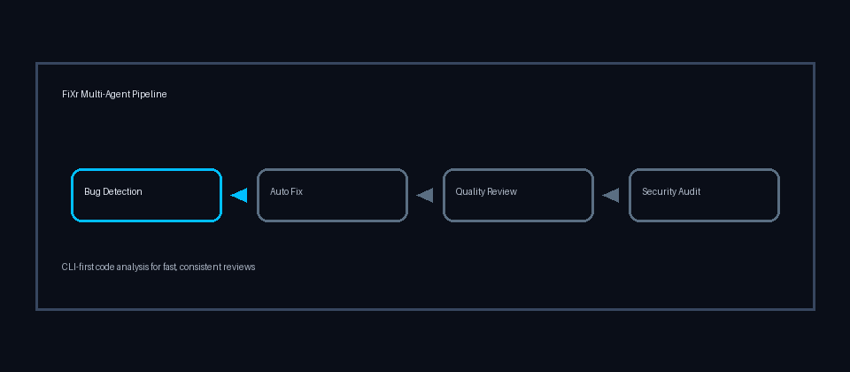
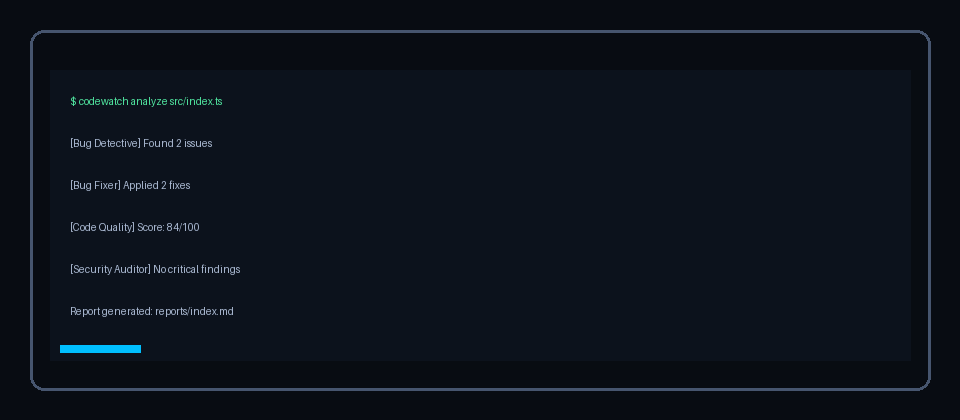

<div align="center">

<!-- Clean SVG Header — static gradient, no deprecated SMIL -->
<svg xmlns="http://www.w3.org/2000/svg" viewBox="0 0 800 180" width="100%">
  <defs>
    <linearGradient id="bg" x1="0%" y1="0%" x2="100%" y2="100%">
      <stop offset="0%" stop-color="#0a0a1a"/>
      <stop offset="50%" stop-color="#1a1a3e"/>
      <stop offset="100%" stop-color="#0f0c29"/>
    </linearGradient>
    <linearGradient id="text" x1="0%" y1="0%" x2="100%" y2="0%">
      <stop offset="0%" stop-color="#00d2ff"/>
      <stop offset="50%" stop-color="#3a7bd5"/>
      <stop offset="100%" stop-color="#00d2ff"/>
    </linearGradient>
    <filter id="glow">
      <feGaussianBlur stdDeviation="3" result="blur"/>
      <feMerge>
        <feMergeNode in="blur"/>
        <feMergeNode in="SourceGraphic"/>
      </feMerge>
    </filter>
  </defs>
  <rect width="800" height="180" fill="url(#bg)" rx="10"/>
  <text x="400" y="95" text-anchor="middle" font-family="-apple-system,BlinkMacSystemFont,'Segoe UI',monospace" font-size="72" font-weight="700" fill="url(#text)" filter="url(#glow)" letter-spacing="-2">FiXr</text>
  <text x="400" y="125" text-anchor="middle" font-family="-apple-system,BlinkMacSystemFont,'Segoe UI',monospace" font-size="13" fill="#888" letter-spacing="2">MULTI-AGENT CODE INTELLIGENCE</text>
  <text x="400" y="150" text-anchor="middle" font-family="-apple-system,BlinkMacSystemFont,'Segoe UI',monospace" font-size="11" fill="#555" letter-spacing="1">Core · TypeScript CLI</text>
</svg>

<br>

[](https://nodejs.org/)
[](https://www.typescriptlang.org/)
[](LICENSE)

</div>

---

## What It Does

FiXr is a terminal-first, multi-agent AI code analysis CLI. It runs a pipeline of specialized agents over your source files — each with a focused responsibility — and produces a unified report with severity-ranked findings, auto-generated fixes, quality scores, and security audits.

Built for engineers who want deterministic code review without leaving the command line.

> **Note:** The product name is **FiXr**. The current CLI executable is **`codewatch`** for backward compatibility.

---

## Visual Workflow

### Agent Pipeline



**Pipeline rules:**
- Bug Fixer consumes findings from Bug Detective
- Code Quality evaluates the fixed code version
- Security Auditor independently scans the original input
- All results aggregate into a single report

### Execution Flow



---

## Product Preview

### Multi-Agent Workflow



### CLI Analyze Output



---

## Capabilities

| Capability | Command | Description |
|:---|:---|:---|
| Single-file analysis | `codewatch analyze <file>` | Full pipeline or selected agents |
| Watch mode | `codewatch watch [dir]` | Debounced file watching with auto-analysis |
| Git diff scanning | `codewatch diff` | Analyze only changed files in working tree |
| Selective execution | `--agents bug,security` | Run subset of agents for speed/cost control |
| Report export | `--output report.md` | Save markdown reports for CI artifacts |
| Model override | `--model gpt-4o` | Switch LLM provider per run |
| Config discovery | `.codewatchrc*` | Cosmiconfig-based project configuration |

---

## Agent Responsibilities

### Agent 1: Bug Detective

Detects runtime and logic defects:
- Null/undefined access
- Boundary errors (off-by-one)
- Async misuse
- Common correctness failures

Findings are categorized by severity: `CRITICAL`, `HIGH`, `MEDIUM`, `LOW`.

### Agent 2: Bug Fixer

Generates corrected code from Detective findings:
- Resolved items marked with `// FIXED:`
- Uncertain cases flagged for manual review
- Produces unified diff against original

### Agent 3: Code Quality Reviewer

Evaluates maintainability:
- Naming quality
- Structure and complexity
- Performance concerns
- Outputs rating (`GOOD`/`FAIR`/`POOR`) + numeric score

### Agent 4: Security Auditor

OWASP-aligned static review:
- Injection vectors (SQL, command, path)
- Weak validation
- Hardcoded secrets
- Path traversal

---

## Installation

```bash
git clone https://github.com/soumyachk101/FiXr.git
cd FiXr
npm install
npm run build
npm link
```

Verify:

```bash
codewatch --version
```

---

## Environment Setup

Create `.env` in project root:

### Anthropic (default)

```env
ANTHROPIC_API_KEY=your-anthropic-key
```

### OpenAI

```env
OPENAI_API_KEY=your-openai-key
```

Usage:

```bash
codewatch analyze src/index.ts --model gpt-4o
```

---

## Model Provider Commands

### Anthropic (Default)

Set your API key:

```bash
export ANTHROPIC_API_KEY=your-anthropic-key
```

Run analysis with default Claude model:

```bash
codewatch analyze src/index.ts
```

Override with a specific Claude model:

```bash
codewatch analyze src/index.ts --model claude-3-opus-20240229
```

Run with selective agents:

```bash
codewatch analyze src/index.ts --agents bug,security --model claude-3-5-sonnet-20240620
```

Export report with Anthropic:

```bash
codewatch analyze src/app.ts --model claude-3-5-sonnet-20240620 -o reports/anthropic-report.md
```

---

### OpenAI

Set your API key:

```bash
export OPENAI_API_KEY=your-openai-key
```

Run with GPT-4o:

```bash
codewatch analyze src/index.ts --model gpt-4o
```

Run with GPT-4 Turbo:

```bash
codewatch analyze src/index.ts --model gpt-4-turbo
```

Run with GPT-3.5 Turbo for faster, cheaper analysis:

```bash
codewatch analyze src/index.ts --model gpt-3.5-turbo
```

Analyze with selective agents using GPT-4o:

```bash
codewatch analyze src/api/claude.ts --agents bug,fixer --model gpt-4o
```

Watch mode with OpenAI:

```bash
codewatch watch src --model gpt-4o
```

Git diff analysis with OpenAI:

```bash
codewatch diff --model gpt-4o
```

---

### DeepSeek

Set your API key and base URL:

```bash
export OPENAI_API_KEY=your-deepseek-key
export OPENAI_API_BASE=https://api.deepseek.com
```

Run with DeepSeek Chat:

```bash
codewatch analyze src/index.ts --model deepseek-chat
```

Run with DeepSeek Coder for code-specific tasks:

```bash
codewatch analyze src/index.ts --model deepseek-coder
```

DeepSeek with selective agents:

```bash
codewatch analyze src/index.ts --agents bug,security --model deepseek-chat
```

Export DeepSeek report:

```bash
codewatch analyze src/app.ts --model deepseek-chat -o reports/deepseek-report.md
```

Watch mode with DeepSeek:

```bash
codewatch watch src --model deepseek-chat
```

---

### Groq

Set your API key and base URL:

```bash
export OPENAI_API_KEY=your-groq-key
export OPENAI_API_BASE=https://api.groq.com/openai/v1
```

Run with Llama 3.3 70B:

```bash
codewatch analyze src/index.ts --model llama-3.3-70b-versatile
```

Run with Llama 3.1 8B for faster inference:

```bash
codewatch analyze src/index.ts --model llama-3.1-8b-instant
```

Run with Mixtral 8x7B:

```bash
codewatch analyze src/index.ts --model mixtral-8x7b-32768
```

Groq with selective agents:

```bash
codewatch analyze src/index.ts --agents bug,quality --model llama-3.3-70b-versatile
```

Export Groq report:

```bash
codewatch analyze src/app.ts --model llama-3.3-70b-versatile -o reports/groq-report.md
```

Watch mode with Groq:

```bash
codewatch watch src --model llama-3.3-70b-versatile
```

Git diff with Groq:

```bash
codewatch diff --model llama-3.3-70b-versatile
```

---

### Ollama (Local)

Start Ollama server locally:

```bash
ollama serve
```

Set the local endpoint:

```bash
export OPENAI_API_KEY=ollama
export OPENAI_API_BASE=http://localhost:11434/v1
```

Run with Llama 3:

```bash
codewatch analyze src/index.ts --model llama3
```

Run with Code Llama for code analysis:

```bash
codewatch analyze src/index.ts --model codellama
```

Run with Mistral:

```bash
codewatch analyze src/index.ts --model mistral
```

Ollama with selective agents:

```bash
codewatch analyze src/index.ts --agents bug,security --model llama3
```

Watch mode with local Ollama:

```bash
codewatch watch src --model llama3
```

Git diff with Ollama:

```bash
codewatch diff --model llama3
```

---

### Other OpenAI-Compatible Providers

For any provider with an OpenAI-compatible endpoint, set:

```bash
export OPENAI_API_KEY=your-provider-key
export OPENAI_API_BASE=https://provider-endpoint.example.com/v1
```

Then run:

```bash
codewatch analyze src/index.ts --model your-model-name
```

---

## Rate Limit Handling

FiXr handles rate limits automatically:

- Retries on HTTP 429 (up to 3 attempts)
- Extracts wait-time from provider messages when available
- Exponential backoff fallback for unstructured responses

---

## Command Reference

### Global invocation

```bash
codewatch <command> [options]
```

### Via npm

```bash
npm start -- <command> [options]
```

### Via Node

```bash
node dist/index.js <command> [options]
```

---

### `analyze <file>`

Analyze one file through the full pipeline or selected agents.

```bash
codewatch analyze <file-path> [options]
```

**Options:**

`--output <path>`, `-o` — Save markdown report to file

```bash
codewatch analyze src/index.ts -o report.md
```

`--agents <list>`, `-a` — Comma-separated agent selection: `bug`, `fixer`, `quality`, `security`

```bash
codewatch analyze src/index.ts --agents bug,security
```

`--model <model>`, `-m` — Override model for this run

```bash
codewatch analyze src/index.ts --model gpt-4o
```

**Examples:**

```bash
codewatch analyze src/index.ts
codewatch analyze src/api/claude.ts --agents bug,security
codewatch analyze scripts/process.py -m llama-3.3-70b-versatile -o reports/process-report.md
```

---

### `watch [dir]`

Watch a directory and analyze files automatically on changes.

```bash
codewatch watch [directory-path]
```

- Defaults to `.` when directory is omitted
- Debounced runs (default: `2000ms`) to reduce duplicate processing
- Ignores `node_modules`, `dist`, `.git`, and configured ignore patterns

**Examples:**

```bash
codewatch watch
codewatch watch src
codewatch watch src --model deepseek-chat
```

---

### `diff`

Analyze files changed in the current git working tree.

```bash
codewatch diff [options]
```

**Options:**

`--agents <list>`, `-a` — Select agents

```bash
codewatch diff --agents bug,security
```

`--model <model>`, `-m` — Override model

```bash
codewatch diff --model gpt-4o
```

**Examples:**

```bash
codewatch diff
codewatch diff --model llama-3.3-70b-versatile
codewatch diff --agents security -o security-diff-report.md
```

---

## Configuration

FiXr uses Cosmiconfig. Resolves from:

- `.codewatchrc.json`
- `.codewatchrc.yaml`
- `codewatch.config.js`
- `codewatch` key in `package.json`

### Default configuration

```json
{
  "agents": ["bug", "fixer", "quality", "security"],
  "ignore": ["node_modules", "dist", "*.test.js", ".git"],
  "watch": {
    "extensions": [".js", ".ts", ".py", ".go"],
    "debounce": 2000
  },
  "output": {
    "format": "terminal",
    "saveReport": false,
    "reportPath": "./reports"
  },
  "model": "claude-3-5-sonnet-20240620",
  "maxTokens": 2000
}
```

---

## Supported Languages

| Extension | Language |
|:---|:---|
| `.js` | JavaScript |
| `.ts` | TypeScript |
| `.py` | Python |
| `.go` | Go |
| `.java` | Java |
| `.cpp` | C++ |
| `.c` | C |
| `.rb` | Ruby |
| `.php` | PHP |
| `.rs` | Rust |

---

## Project Structure

```
FiXr/
src/
  index.ts              CLI entrypoint
  api/
    claude.ts           LLM client (Anthropic + OpenAI-compatible)
  agents/
    types.ts            Shared interfaces, PipelineContext
    pipeline.ts         Orchestration, agent sequencing
    bugDetective.ts     Static analysis — null, boundary, async
    bugFixer.ts         Patch generation, // FIXED: annotations
    codeQuality.ts      Complexity, naming, structure scoring
    securityAudit.ts    OWASP vulnerability scanning
  commands/
    analyze.ts          Single-file pipeline execution
    watch.ts            File watcher with debounce
    diff.ts             Git working-tree change analysis
  config/
    loader.ts           Cosmiconfig resolution
  output/
    terminal.ts         Rich terminal formatting
    markdown.ts         Markdown report generation
docs/
  assets/
    fixr-overview.gif   Workflow demo
    fixr-cli-demo.gif   CLI output demo
package.json
tsconfig.json
```

---

## Development

```bash
npm run watch    # Auto-rebuild on change
npm run build    # Production build
npm start        # Run via npm
```

---

## Sample Output

```text
━━━━━━━━━━━━━━━━━━━━━━━━━━━━━━━━━━━━━━━━
CodeWatch — Multi-Agent Analysis
File: src/app.ts
━━━━━━━━━━━━━━━━━━━━━━━━━━━━━━━━━━━━━━━━

BUG DETECTIVE
  [HIGH]   Line 23 — missing null check before user.name
  [MEDIUM] Line 45 — possible off-by-one in loop boundary

BUG FIXER
  - Added null guard before user.name on line 23
  - Corrected loop termination condition on line 45

CODE QUALITY
  Rating: GOOD (78/100)
  - processData is too long (87 lines); consider extraction

SECURITY AUDITOR
  [CRITICAL] Line 34 — SQL injection risk in raw query construction

━━━━━━━━━━━━━━━━━━━━━━━━━━━━━━━━━━━━━━━━
Score: 78/100 | Issues: 3
━━━━━━━━━━━━━━━━━━━━━━━━━━━━━━━━━━━━━━━━
```

---

## License

ISC

