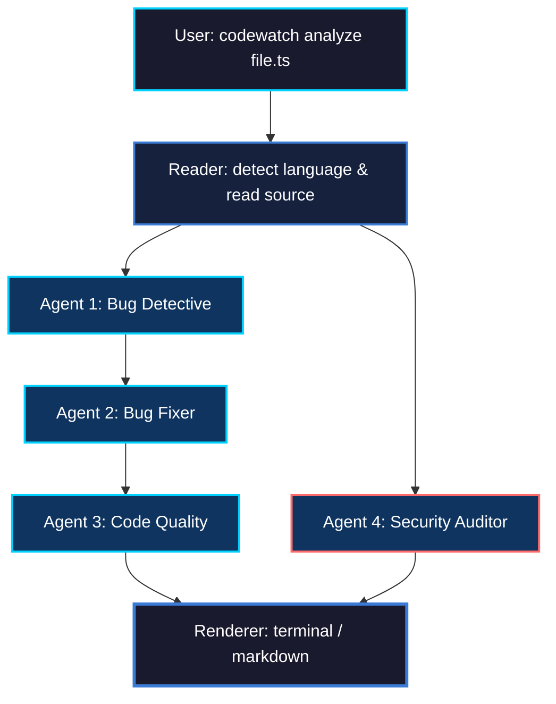
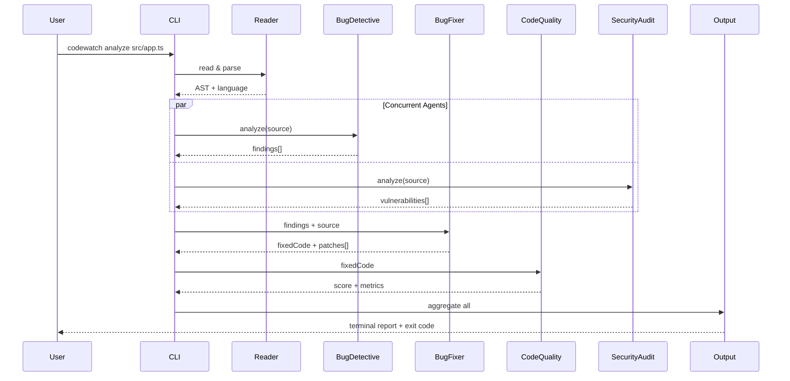

<div align="center">

<!-- Clean SVG Header — static gradient, no deprecated SMIL -->
<svg xmlns="http://www.w3.org/2000/svg" viewBox="0 0 800 180" width="100%">
  <defs>
    <linearGradient id="bg" x1="0%" y1="0%" x2="100%" y2="100%">
      <stop offset="0%" stop-color="#0a0a1a"/>
      <stop offset="50%" stop-color="#1a1a3e"/>
      <stop offset="100%" stop-color="#0f0c29"/>
    </linearGradient>
    <linearGradient id="text" x1="0%" y1="0%" x2="100%" y2="0%">
      <stop offset="0%" stop-color="#00d2ff"/>
      <stop offset="50%" stop-color="#3a7bd5"/>
      <stop offset="100%" stop-color="#00d2ff"/>
    </linearGradient>
    <filter id="glow">
      <feGaussianBlur stdDeviation="3" result="blur"/>
      <feMerge>
        <feMergeNode in="blur"/>
        <feMergeNode in="SourceGraphic"/>
      </feMerge>
    </filter>
  </defs>
  <rect width="800" height="180" fill="url(#bg)" rx="10"/>
  <text x="400" y="95" text-anchor="middle" font-family="-apple-system,BlinkMacSystemFont,'Segoe UI',monospace" font-size="72" font-weight="700" fill="url(#text)" filter="url(#glow)" letter-spacing="-2">FiXr</text>
  <text x="400" y="125" text-anchor="middle" font-family="-apple-system,BlinkMacSystemFont,'Segoe UI',monospace" font-size="13" fill="#888" letter-spacing="2">MULTI-AGENT CODE INTELLIGENCE</text>
  <text x="400" y="150" text-anchor="middle" font-family="-apple-system,BlinkMacSystemFont,'Segoe UI',monospace" font-size="11" fill="#555" letter-spacing="1">Core · TypeScript CLI</text>
</svg>

<br>

[](https://nodejs.org/)
[](https://www.typescriptlang.org/)
[](LICENSE)

</div>

---

## Table of Contents

- [Overview](#overview)
- [Architecture](#architecture)
- [Prerequisites](#prerequisites)
- [Installation](#installation)
- [Environment Variables](#environment-variables)
- [CLI Commands](#cli-commands)
  - [`codewatch analyze`](#codewatch-analyze-file)
  - [`codewatch watch`](#codewatch-watch-dir)
  - [`codewatch diff`](#codewatch-diff)
- [Agent Pipeline](#agent-pipeline)
  - [Agent 1: Bug Detective](#agent-1-bug-detective)
  - [Agent 2: Bug Fixer](#agent-2-bug-fixer)
  - [Agent 3: Code Quality Reviewer](#agent-3-code-quality-reviewer)
  - [Agent 4: Security Auditor](#agent-4-security-auditor)
- [LLM Provider Configuration](#llm-provider-configuration)
  - [Anthropic (Default)](#anthropic-default)
  - [OpenAI](#openai)
  - [DeepSeek](#deepseek)
  - [Groq](#groq)
  - [Ollama (Local)](#ollama-local)
  - [Other OpenAI-Compatible Providers](#other-openai-compatible-providers)
- [Configuration File](#configuration-file)
- [Supported Languages](#supported-languages)
- [Project Structure](#project-structure)
- [Development](#development)
- [Rate Limit Handling](#rate-limit-handling)
- [Sample Output](#sample-output)
- [License](#license)

---

## Overview

FiXr is a terminal-first, multi-agent AI code analysis CLI. It runs a pipeline of four specialized LLM agents over your source files — each with a focused responsibility — and produces a unified report with severity-ranked findings, auto-generated fixes, quality scores, and security audits.

Built for engineers who want deterministic code review without leaving the command line.

> **Note:** The product name is **FiXr**. The CLI executable is **`codewatch`** (for backward compatibility).

---

## Architecture

### Agent Pipeline



**Pipeline execution order:**

1. **Reader** — reads source file, detects language by file extension
2. **Bug Detective** — scans for runtime/logic defects (runs on original code)
3. **Bug Fixer** — consumes Bug Detective findings, generates patched code
4. **Code Quality** — evaluates fixed code (if available) or original code
5. **Security Auditor** — independently scans original code for OWASP-class vulnerabilities

**Key rules:**
- Bug Fixer requires Bug Detective output — skipped if no bugs found
- Code Quality analyzes the fixed code version when Bug Fixer ran
- Security Auditor runs independently on the original source
- Agents can be selectively enabled/disabled via `--agents` flag

### Execution Flow



### Product Preview

#### Multi-Agent Workflow


#### CLI Analyze Output


---

## Prerequisites

| Dependency | Minimum Version | Purpose |
|:---|:---|:---|
| [Node.js](https://nodejs.org/) | 18+ | Runtime |
| [npm](https://npmjs.com/) | 9+ | Package manager |
| [Git](https://git-scm.com/) | 2.0+ | Required for `codewatch diff` command |
| LLM API key | — | At least one provider (Anthropic, OpenAI, DeepSeek, Groq, or local Ollama) |

---

## Installation

### From Source

```bash
# Clone the repository
git clone https://github.com/soumyachk101/FiXr.git
cd FiXr

# Install dependencies
npm install

# Compile TypeScript to JavaScript
npm run build

# Link the CLI globally (makes `codewatch` available in any directory)
npm link
```

### Verify Installation

```bash
codewatch --version
# Expected output: 1.0.0
```

### Unlink (if needed)

```bash
npm unlink -g codewatch
```

---

## Environment Variables

Create a `.env` file in the project root, or export variables in your shell.

### Required (pick one provider minimum)

| Variable | Required For | Description |
|:---|:---|:---|
| `ANTHROPIC_API_KEY` | Anthropic Claude models | Your Anthropic API key |
| `OPENAI_API_KEY` | OpenAI, DeepSeek, Groq, Ollama, or any OpenAI-compatible provider | API key for the provider |
| `LLM_API_KEY` | Fallback for non-Anthropic providers | Alternative to `OPENAI_API_KEY` |

### Optional

| Variable | Default | Description |
|:---|:---|:---|
| `OPENAI_API_BASE` | `https://api.openai.com/v1` | Base URL for OpenAI-compatible providers (DeepSeek, Groq, Ollama, etc.) |

### Provider-Specific Examples

```bash
# Anthropic (default)
export ANTHROPIC_API_KEY=sk-ant-...

# OpenAI
export OPENAI_API_KEY=sk-...

# DeepSeek
export OPENAI_API_KEY=sk-deepseek-...
export OPENAI_API_BASE=https://api.deepseek.com

# Groq
export OPENAI_API_KEY=gsk_...
export OPENAI_API_BASE=https://api.groq.com/openai/v1

# Ollama (local)
export OPENAI_API_KEY=ollama
export OPENAI_API_BASE=http://localhost:11434/v1
```

---

## CLI Commands

### Global Invocation

```bash
codewatch <command> [options]
```

### Via npm

```bash
npm start -- <command> [options]
```

### Via Node Directly

```bash
node dist/index.js <command> [options]
```

---

### `codewatch analyze <file>`

Analyze a single file through the full agent pipeline (or a selected subset).

```
codewatch analyze <file-path> [options]
```

#### Arguments

| Argument | Required | Description |
|:---|:---|:---|
| `<file>` | Yes | Path to the source file to analyze (absolute or relative) |

#### Options

| Flag | Short | Type | Default | Description |
|:---|:---|:---|:---|:---|
| `--output <path>` | `-o` | `string` | `./reports/report-<filename>.md` | Save markdown report to specified file path |
| `--agents <list>` | `-a` | `string` | `bug,fixer,quality,security` | Comma-separated list of agents to run |
| `--model <model>` | `-m` | `string` | `claude-3-5-sonnet-20240620` | LLM model identifier to use for this run |

#### Agent Values for `--agents`

| Value | Agent | Description |
|:---|:---|:---|
| `bug` | Bug Detective | Detects runtime and logic defects |
| `fixer` | Bug Fixer | Generates corrected code from findings |
| `quality` | Code Quality Reviewer | Evaluates maintainability and structure |
| `security` | Security Auditor | OWASP-aligned vulnerability scanning |

#### Examples

```bash
# Full pipeline — all 4 agents
codewatch analyze src/index.ts

# Only bug detection and security audit (skip fixer + quality)
codewatch analyze src/index.ts --agents bug,security

# Analyze with a specific model and save report
codewatch analyze src/app.ts --model gpt-4o -o reports/app-analysis.md

# Analyze Python file with DeepSeek
codewatch analyze scripts/etl.py --model deepseek-chat

# Only security audit, save to custom path
codewatch analyze src/auth.ts --agents security -o security-report.md

# Analyze with Groq Llama model
codewatch analyze src/api/handler.ts --model llama-3.3-70b-versatile

# Quick bug scan with local Ollama
codewatch analyze src/utils.ts --agents bug --model llama3
```

---

### `codewatch watch [dir]`

Watch a directory for file changes and automatically run the analysis pipeline on modified files.

```
codewatch watch [directory-path]
```

#### Arguments

| Argument | Required | Default | Description |
|:---|:---|:---|:---|
| `[dir]` | No | `.` (current directory) | Directory to watch for changes |

#### Behavior

- Uses [chokidar](https://github.com/paulmillr/chokidar) for reliable file system watching
- Debounced execution (default: `2000ms`) prevents duplicate analysis on rapid saves
- Filters by configured file extensions (default: `.js`, `.ts`, `.py`, `.go`)
- Ignores `node_modules`, `dist`, `.git`, and `*.test.js` by default
- Runs the full agent pipeline (configurable via `.codewatchrc`)
- Press `Ctrl+C` to stop watching

#### Examples

```bash
# Watch current directory
codewatch watch

# Watch specific source directory
codewatch watch src

# Watch with a specific model
codewatch watch src --model gpt-4o

# Watch Python project
codewatch watch app --model deepseek-chat
```

---

### `codewatch diff`

Analyze only files that have been modified in the current git working tree (uncommitted changes).

```
codewatch diff [options]
```

#### Options

| Flag | Short | Type | Default | Description |
|:---|:---|:---|:---|:---|
| `--agents <list>` | `-a` | `string` | `bug,fixer,quality,security` | Comma-separated list of agents to run |
| `--model <model>` | `-m` | `string` | `claude-3-5-sonnet-20240620` | LLM model identifier to use |

#### Behavior

- Runs `git diff --name-only HEAD` to detect changed files
- Iterates through each changed file and runs the analysis pipeline sequentially
- Skips files that no longer exist on disk
- Reports total number of changed files before analysis begins

#### Examples

```bash
# Analyze all uncommitted changes with default settings
codewatch diff

# Security-only scan on changed files
codewatch diff --agents security

# Full pipeline with Groq on changed files
codewatch diff --model llama-3.3-70b-versatile

# Save diff report
codewatch diff --agents bug,security -o diff-security-report.md
```

---

## Agent Pipeline

### Agent 1: Bug Detective

**File:** `src/agents/bugDetective.ts`

Performs static analysis on the original source code to detect runtime and logic defects.

**Detection categories:**

| Category | Examples |
|:---|:---|
| Null/undefined references | Accessing `.property` on potentially null objects |
| Off-by-one errors | Loop boundary conditions, array index mistakes |
| Async/await misuse | Missing `await`, unhandled promise rejections |
| Logic errors | Incorrect conditionals, inverted boolean checks |
| Edge cases | Empty arrays, zero values, empty strings |
| Unused variables | May indicate missing or dead logic |
| Missing error handling | Unprotected I/O, network calls without try/catch |
| Infinite loops | Missing break/exit conditions |

**Severity levels:** `HIGH` (crashes/wrong behavior in production), `MEDIUM` (issues under specific conditions), `LOW` (minor issues/code smells)

**Output format:** JSON with `bugs[]` array and `summary` string.

---

### Agent 2: Bug Fixer

**File:** `src/agents/bugFixer.ts`

Consumes Bug Detective findings and generates corrected code patches.

**Behavior:**
- Fixes only the bugs listed by Bug Detective — does not rewrite the file
- Preserves original code style, formatting, and structure
- Adds inline `// FIXED: <reason>` comments on each corrected line
- If a bug cannot be safely fixed without more context, adds `// TODO: needs manual fix — <reason>`
- Skipped entirely if Bug Detective found zero bugs

**Output format:** JSON with `fixedCode` (complete patched source), `fixes[]` (applied patches), and `unfixed[]` (patches that need manual review).

---

### Agent 3: Code Quality Reviewer

**File:** `src/agents/codeQuality.ts`

Evaluates the fixed code (post Bug Fixer) or original code for maintainability and quality.

**Evaluation criteria:**

| Criterion | What It Checks |
|:---|:---|
| Readability | Unclear variable/function names, complex logic |
| Structure | Functions longer than 30 lines, missing decomposition |
| Best practices | Language-specific patterns and conventions |
| Maintainability | Magic numbers, duplicated logic, missing comments |
| Performance | O(n^2) where O(n) is possible, unnecessary allocations |
| Documentation | Missing JSDoc/docstrings on public functions |

**Rating scale:** `EXCELLENT` / `GOOD` / `NEEDS_WORK` / `POOR` with numeric score (0-100)

**Output format:** JSON with `rating`, `score`, `suggestions[]`, `positives[]`, and `summary`.

---

### Agent 4: Security Auditor

**File:** `src/agents/securityAudit.ts`

Performs an OWASP-aligned security review on the original source code.

**Vulnerability categories:**

| Category | OWASP Reference |
|:---|:---|
| Injection (SQL, command, LDAP) | A03:2021-Injection |
| XSS (reflected, stored, DOM-based) | A03:2021-Injection |
| Hardcoded secrets (API keys, passwords, tokens) | A02:2021-Cryptographic Failures |
| Insecure direct object references (IDOR) | A01:2021-Broken Access Control |
| Broken authentication / missing auth checks | A07:2021-Identification and Authentication Failures |
| Sensitive data exposure (logging PII, plaintext passwords) | A02:2021-Cryptographic Failures |
| Insecure deserialization | A08:2021-Software and Data Integrity Failures |
| Path traversal | A01:2021-Broken Access Control |
| CORS misconfiguration (wildcard origins) | A05:2021-Security Misconfiguration |
| Weak cryptography (MD5, SHA1 for passwords) | A02:2021-Cryptographic Failures |
| Race conditions | A04:2021-Insecure Design |
| Insecure random (`Math.random()` for security) | A02:2021-Cryptographic Failures |

**Severity levels:** `CRITICAL`, `HIGH`, `MEDIUM`, `LOW`, `INFO`

**Output format:** JSON with `issues[]`, `overallRisk`, and `summary`.

---

## LLM Provider Configuration

FiXr supports Anthropic natively and any OpenAI-compatible provider via the `--model` flag.

### Anthropic (Default)

```bash
export ANTHROPIC_API_KEY=your-anthropic-key

# Default Claude model
codewatch analyze src/index.ts

# Specific Claude model
codewatch analyze src/index.ts --model claude-3-opus-20240229

# With selective agents
codewatch analyze src/index.ts --agents bug,security --model claude-3-5-sonnet-20240620

# Export report
codewatch analyze src/app.ts --model claude-3-5-sonnet-20240620 -o reports/anthropic-report.md
```

### OpenAI

```bash
export OPENAI_API_KEY=your-openai-key

codewatch analyze src/index.ts --model gpt-4o
codewatch analyze src/index.ts --model gpt-4-turbo
codewatch analyze src/index.ts --model gpt-3.5-turbo

# Selective agents
codewatch analyze src/api/claude.ts --agents bug,fixer --model gpt-4o

# Watch mode
codewatch watch src --model gpt-4o

# Git diff
codewatch diff --model gpt-4o
```

### DeepSeek

```bash
export OPENAI_API_KEY=your-deepseek-key
export OPENAI_API_BASE=https://api.deepseek.com

codewatch analyze src/index.ts --model deepseek-chat
codewatch analyze src/index.ts --model deepseek-coder

# Selective agents
codewatch analyze src/index.ts --agents bug,security --model deepseek-chat

# Export report
codewatch analyze src/app.ts --model deepseek-chat -o reports/deepseek-report.md

# Watch mode
codewatch watch src --model deepseek-chat
```

### Groq

```bash
export OPENAI_API_KEY=your-groq-key
export OPENAI_API_BASE=https://api.groq.com/openai/v1

codewatch analyze src/index.ts --model llama-3.3-70b-versatile
codewatch analyze src/index.ts --model llama-3.1-8b-instant
codewatch analyze src/index.ts --model mixtral-8x7b-32768

# Selective agents
codewatch analyze src/index.ts --agents bug,quality --model llama-3.3-70b-versatile

# Export report
codewatch analyze src/app.ts --model llama-3.3-70b-versatile -o reports/groq-report.md

# Watch mode
codewatch watch src --model llama-3.3-70b-versatile

# Git diff
codewatch diff --model llama-3.3-70b-versatile
```

### Ollama (Local)

```bash
# Start Ollama server
ollama serve

# Set environment
export OPENAI_API_KEY=ollama
export OPENAI_API_BASE=http://localhost:11434/v1

# Run with local models
codewatch analyze src/index.ts --model llama3
codewatch analyze src/index.ts --model codellama
codewatch analyze src/index.ts --model mistral

# Selective agents
codewatch analyze src/index.ts --agents bug,security --model llama3

# Watch mode
codewatch watch src --model llama3

# Git diff
codewatch diff --model llama3
```

### Other OpenAI-Compatible Providers

For any provider with an OpenAI-compatible `/v1/chat/completions` endpoint:

```bash
export OPENAI_API_KEY=your-provider-key
export OPENAI_API_BASE=https://provider-endpoint.example.com/v1

codewatch analyze src/index.ts --model your-model-name
```

**Examples:** OpenRouter, Together AI, Fireworks AI, Perplexity, Mistral API, etc.

---

## Configuration File

FiXr uses [Cosmiconfig](https://github.com/cosmiconfig/cosmiconfig) for project-level configuration. The following files are searched in order:

| File | Format |
|:---|:---|
| `.codewatchrc.json` | JSON |
| `.codewatchrc.yaml` | YAML |
| `.codewatchrc.yml` | YAML |
| `.codewatchrc.js` | JavaScript |
| `.codewatchrc.cjs` | CommonJS |
| `codewatch.config.js` | JavaScript |
| `codewatch.config.cjs` | CommonJS |
| `codewatch` key in `package.json` | JSON |

### Default Configuration

```json
{
  "agents": ["bug", "fixer", "quality", "security"],
  "ignore": ["node_modules", "dist", "*.test.js", ".git"],
  "watch": {
    "extensions": [".js", ".ts", ".py", ".go"],
    "debounce": 2000
  },
  "output": {
    "format": "terminal",
    "saveReport": false,
    "reportPath": "./reports"
  },
  "model": "claude-3-5-sonnet-20240620",
  "maxTokens": 2000
}
```

### Configuration Reference

| Key | Type | Default | Description |
|:---|:---|:---|:---|
| `agents` | `string[]` | `["bug", "fixer", "quality", "security"]` | Default agents to run when `--agents` is not specified |
| `ignore` | `string[]` | `["node_modules", "dist", "*.test.js", ".git"]` | Patterns to ignore in watch mode |
| `watch.extensions` | `string[]` | `[".js", ".ts", ".py", ".go"]` | File extensions to watch for changes |
| `watch.debounce` | `number` | `2000` | Milliseconds to wait before analyzing after a file change |
| `output.format` | `"terminal" \| "markdown"` | `"terminal"` | Default output format |
| `output.saveReport` | `boolean` | `false` | Automatically save markdown reports |
| `output.reportPath` | `string` | `"./reports"` | Directory for auto-saved reports |
| `model` | `string` | `"claude-3-5-sonnet-20240620"` | Default LLM model |
| `maxTokens` | `number` | `2000` | Max tokens per LLM response |

### Example: Project-Level Config

Create `.codewatchrc.json` in your project root:

```json
{
  "agents": ["bug", "security"],
  "model": "gpt-4o",
  "watch": {
    "extensions": [".ts", ".tsx"],
    "debounce": 3000
  },
  "ignore": ["node_modules", "dist", "__tests__", "coverage"],
  "output": {
    "format": "terminal",
    "saveReport": true,
    "reportPath": "./ci-reports"
  }
}
```

---

## Supported Languages

| Extension | Language | Bug Detective | Bug Fixer | Code Quality | Security Auditor |
|:---|:---|:---:|:---:|:---:|:---:|
| `.js` | JavaScript | ✅ | ✅ | ✅ | ✅ |
| `.ts` | TypeScript | ✅ | ✅ | ✅ | ✅ |
| `.py` | Python | ✅ | ✅ | ✅ | ✅ |
| `.go` | Go | ✅ | ✅ | ✅ | ✅ |
| `.java` | Java | ✅ | ✅ | ✅ | ✅ |
| `.cpp` | C++ | ✅ | ✅ | ✅ | ✅ |
| `.c` | C | ✅ | ✅ | ✅ | ✅ |
| `.rb` | Ruby | ✅ | ✅ | ✅ | ✅ |
| `.php` | PHP | ✅ | ✅ | ✅ | ✅ |
| `.rs` | Rust | ✅ | ✅ | ✅ | ✅ |

> All agents work on all supported languages. Quality depends on the LLM's training data for each language.

---

## Project Structure

```
FiXr/
├── src/
│   ├── index.ts                  # CLI entrypoint — Commander.js setup, command registration
│   │
│   ├── api/
│   │   └── claude.ts             # LLM client — Anthropic SDK + OpenAI-compatible fetch
│   │                               # Handles routing, rate limiting, retries (3 attempts)
│   │
│   ├── agents/
│   │   ├── types.ts              # TypeScript interfaces (Bug, Fix, QualityReport, SecurityIssue, PipelineContext)
│   │   ├── pipeline.ts           # Orchestrator — language detection, agent sequencing
│   │   ├── bugDetective.ts       # Agent 1 — bug detection (null, boundary, async, logic)
│   │   ├── bugFixer.ts           # Agent 2 — patch generation with // FIXED: annotations
│   │   ├── codeQuality.ts        # Agent 3 — maintainability scoring (0-100)
│   │   └── securityAudit.ts      # Agent 4 — OWASP vulnerability scanning
│   │
│   ├── commands/
│   │   ├── analyze.ts            # Single-file pipeline execution
│   │   ├── watch.ts              # Chokidar file watcher with lodash debounce
│   │   └── diff.ts               # Git diff — iterates changed files through pipeline
│   │
│   ├── config/
│   │   └── loader.ts             # Cosmiconfig resolution, default config, Config interface
│   │
│   └── output/
│       ├── terminal.ts           # Chalk-based terminal renderer with severity coloring
│       └── markdown.ts           # Markdown report generator with table formatting
│
├── docs/
│   └── assets/
│       ├── fixr-overview.gif     # Workflow demo
│       └── fixr-cli-demo.gif     # CLI output demo
│
├── package.json                  # npm config, dependencies, bin entry
├── tsconfig.json                 # TypeScript config (ES2020, CommonJS, strict)
├── .gitignore
└── README.md
```

### Key Source Files

| File | Lines | Purpose |
|:---|:---|:---|
| `src/index.ts` | ~34 | CLI entrypoint — registers 3 commands with Commander.js |
| `src/api/claude.ts` | ~124 | Unified LLM client — routes to Anthropic SDK or OpenAI-compatible fetch |
| `src/agents/pipeline.ts` | ~51 | Pipeline orchestrator — reads file, detects language, runs agents in sequence |
| `src/agents/bugDetective.ts` | ~63 | Bug detection agent with structured JSON prompt |
| `src/agents/bugFixer.ts` | ~63 | Bug fixing agent — consumes Detective output |
| `src/agents/codeQuality.ts` | ~62 | Code quality agent — evaluates fixed or original code |
| `src/agents/securityAudit.ts` | ~68 | Security audit agent — OWASP-aligned scanning |
| `src/commands/analyze.ts` | ~40 | Analyze command — loads config, runs pipeline, renders output |
| `src/commands/watch.ts` | ~38 | Watch command — chokidar + debounce + pipeline |
| `src/commands/diff.ts` | ~24 | Diff command — git diff + iterate + analyze |
| `src/config/loader.ts` | ~44 | Config loader — cosmiconfig with typed defaults |
| `src/output/terminal.ts` | ~59 | Terminal renderer — chalk coloring, severity badges |
| `src/output/markdown.ts` | ~58 | Markdown report — tables for bugs, fixes, quality, security |

---

## Development

### npm Scripts

| Command | Description |
|:---|:---|
| `npm run build` | Compile TypeScript to JavaScript (`tsc`) |
| `npm run watch` | Auto-rebuild on file change (`tsc -w`) |
| `npm start` | Run the CLI via Node (`node dist/index.js`) |

### Development Workflow

```bash
# Terminal 1: Watch for TypeScript changes
npm run watch

# Terminal 2: Run commands against source files
npm start -- analyze src/index.ts
npm start -- watch src
npm start -- diff
```

### Building for Production

```bash
# Clean build
rm -rf dist/
npm run build

# Verify output
ls dist/
# Should contain: index.js, api/, agents/, commands/, config/, output/
```

### Linking for Local Development

```bash
# After building, link globally
npm link

# Now `codewatch` is available in any directory
codewatch --version
codewatch analyze /path/to/any/file.ts
```

---

## Rate Limit Handling

FiXr handles API rate limits automatically for non-Anthropic providers:

| Behavior | Details |
|:---|:---|
| Max retries | 3 attempts on HTTP 429 |
| Wait-time parsing | Extracts retry delay from provider error messages (seconds or milliseconds) |
| Exponential backoff | Falls back to 1s → 2s → 4s if no wait-time is provided |
| Anthropic SDK | Handled natively by `@anthropic-ai/sdk` |

---

## Sample Output

```text
━━━━━━━━━━━━━━━━━━━━━━━━━━━━━━━━━━━━━━━━
  CodeWatch — Multi-Agent Analysis
  File: src/app.ts
━━━━━━━━━━━━━━━━━━━━━━━━━━━━━━━━━━━━━━━━

🐛 BUG DETECTIVE
  [HIGH] Line 23 — missing null check before user.name
  [MEDIUM] Line 45 — possible off-by-one in loop boundary

🔧 BUG FIXER
  - Added null guard before user.name on line 23
  - Corrected loop termination condition on line 45

✨ CODE QUALITY
  Rating: GOOD (78/100)
  - processData is too long (87 lines); consider extraction
    Suggestion: Split into 3 smaller functions: validateInput(), transformData(), formatOutput()

🔒 SECURITY AUDITOR
  [CRITICAL] Line 34 — SQL injection risk in raw query construction
    User input directly concatenated into SQL query without sanitization

━━━━━━━━━━━━━━━━━━━━━━━━━━━━━━━━━━━━━━━━
  Score: 78/100  |  Issues: 3
━━━━━━━━━━━━━━━━━━━━━━━━━━━━━━━━━━━━━━━━
```

### Markdown Report Structure

When using `--output` or `saveReport: true`, the markdown report includes:

1. **Bug Detective** — severity/line/description/category table
2. **Bug Fixer** — applied fixes list + complete fixed code block
3. **Code Quality** — priority/category/line/issue/suggestion table + rating + score
4. **Security Auditor** — severity/line/title/description/OWASP table + overall risk

---

## License

ISC
