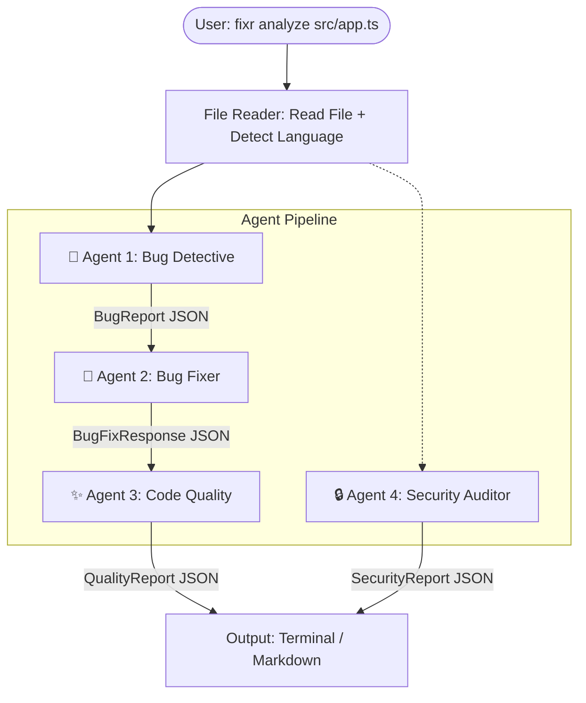

# FiXr — Multi-Agent AI Code Analysis CLI

FiXr is a developer-first CLI tool that pipes your source code through **four specialized AI agents** to detect bugs, auto-fix them, score code quality, and audit for security vulnerabilities — all powered by the Anthropic Claude API.

## 🚀 Why FiXr?

Instead of manually reviewing code or copy-pasting into an AI chat, FiXr runs a structured, multi-agent pipeline directly from your terminal. Each agent is purpose-built with a focused prompt, producing structured JSON that feeds into the next stage.

---

## 📊 Architecture

FiXr uses a **sequential multi-agent pipeline** where each agent's output enriches a shared context object (`PipelineContext`) that flows through the chain.



**Key detail:** The Bug Fixer receives the bugs found by the Bug Detective. The Code Quality agent analyzes the *fixed* code (not the original). The Security Auditor runs independently on the original code.

---

## ✨ Features

| Feature | Description |
|---------|-------------|
| **Single File Analysis** | Analyze any file with `fixr analyze <file>` |
| **Folder Watch Mode** | Auto-analyze files on save with `fixr watch [dir]` (powered by Chokidar + Lodash debounce) |
| **Git Diff Analysis** | Analyze only files changed in the current branch with `fixr diff` |
| **Markdown Reports** | Export detailed reports with `--output report.md` or via config |
| **Selective Agents** | Run only the agents you need: `--agents bug,security` |
| **Custom Models** | Override the AI model per-run: `--model <model-name>` |
| **Config File Support** | Project-level `.codewatchrc.json` config via Cosmiconfig |

---

## 🤖 The 4 Specialized Agents

### Agent 1 — 🐛 Bug Detective
Scans for logic errors, null references, off-by-one mistakes, async/await issues, unhandled edge cases, typos, and more. Each bug is assigned **HIGH / MEDIUM / LOW** severity and categorized.

### Agent 2 — 🔧 Bug Fixer
Receives the bug list from Agent 1 and produces a corrected version of the source code. Adds inline `// FIXED:` comments on changed lines. Bugs it can't safely fix are flagged as `// TODO: needs manual fix`.

### Agent 3 — ✨ Code Quality Reviewer
Analyzes the *fixed* code for readability, structure, naming conventions, performance inefficiencies, and documentation gaps. Outputs an overall rating (**EXCELLENT / GOOD / NEEDS_WORK / POOR**) and a numeric score out of 100.

### Agent 4 — 🔒 Security Auditor
Performs a thorough security audit on the original code. Checks for injection vulnerabilities, XSS, hardcoded secrets, IDOR, path traversal, CORS misconfigs, weak crypto, and more. Maps findings to **OWASP Top 10** categories where applicable.

---

## 📁 Project Structure

```
FiXr/
├── src/
│   ├── index.ts              # CLI entry point (Commander.js)
│   ├── api/
│   │   └── claude.ts          # Anthropic Claude API client
│   ├── agents/
│   │   ├── types.ts           # TypeScript interfaces for all agent I/O
│   │   ├── pipeline.ts        # Sequential agent orchestration + language detection
│   │   ├── bugDetective.ts    # Agent 1: Bug detection
│   │   ├── bugFixer.ts        # Agent 2: Automated bug fixing
│   │   ├── codeQuality.ts     # Agent 3: Code quality review
│   │   └── securityAudit.ts   # Agent 4: Security audit
│   ├── commands/
│   │   ├── analyze.ts         # `analyze <file>` command handler
│   │   ├── watch.ts           # `watch [dir]` command handler
│   │   └── diff.ts            # `diff` command handler (git integration)
│   ├── config/
│   │   └── loader.ts          # Cosmiconfig-based config loader
│   └── output/
│       ├── terminal.ts        # Chalk-powered terminal renderer
│       └── markdown.ts        # Markdown report generator
├── package.json
├── tsconfig.json
└── .gitignore
```

---

## 📦 Installation

### Prerequisites

- **Node.js** (v18 or higher recommended)
- **Anthropic API Key** — [Get one here](https://console.anthropic.com/)

### Setup

```bash
# Clone the repository
git clone https://github.com/soumyachk101/FiXr.git
cd FiXr

# Install dependencies
npm install

# Build the TypeScript source
npm run build

# Link globally (optional — makes `codewatch` available everywhere)
npm link
```

### Environment & Multi-Provider Support

FiXr is now provider-agnostic. Any model starting with `claude-` will use the official Anthropic SDK, while any other model will route to an OpenAI-compatible API endpoint (using standard `fetch` without requiring extra NPM packages).

Create a `.env` file in the project root:

#### Option A: Anthropic Claude (Default)
```env
ANTHROPIC_API_KEY=your-anthropic-key
```

#### Option B: OpenAI (e.g. GPT-4o)
```env
OPENAI_API_KEY=your-openai-key
```
Then run or configure with `--model gpt-4o`.

#### Option C: Other OpenAI-Compatible Providers (DeepSeek, Groq, OpenRouter, Ollama)
Configure `OPENAI_API_BASE` alongside the API key.

- **DeepSeek:**
  ```env
  OPENAI_API_KEY=your-deepseek-key
  OPENAI_API_BASE=https://api.deepseek.com
  ```
  Use model: `--model deepseek-chat`
  
- **Groq:**
  ```env
  OPENAI_API_KEY=your-groq-key
  OPENAI_API_BASE=https://api.groq.com/openai/v1
  ```
  Use model: `--model llama-3.3-70b-versatile`

- **Local Ollama:**
  ```env
  OPENAI_API_KEY=ollama
  OPENAI_API_BASE=http://localhost:11434/v1
  ```
  Use model: `--model llama3`

#### ⚡ Rate Limit Handling & Auto-Retries
FiXr includes built-in rate-limit (HTTP 429) protection for OpenAI-compatible endpoints (like Groq):
- **Smart Parsing:** It parses error messages from providers (like Groq's `try again in 440ms` or `try again in 1.2s`) to compute precise wait times.
- **Auto-Retries:** Automatically retries up to 3 times before failing.
- **Exponential Backoff:** If the error message format is unrecognized, it falls back to exponential backoff (starting at 1s, doubling each time).

---

## 📖 Command Reference & Usage Guide

FiXr can be executed either globally (if linked using `npm link`) or locally within this project root.

### Invocation Methods
- **Global:** `codewatch <command> [options]`
- **Local (npm):** `npm start -- <command> [options]`
- **Local (node):** `node dist/index.js <command> [options]`

---

### 1. `analyze <file>`
Analyzes a single specific file with the multi-agent pipeline.

#### Syntax
```bash
codewatch analyze <file-path> [options]
```

#### Options
| Option | Short | Description |
|---|---|---|
| `--output <path>` | `-o` | File path to save the generated Markdown report. |
| `--agents <list>` | `-a` | Comma-separated agents to run: `bug`, `fixer`, `quality`, `security`. |
| `--model <model>` | `-m` | Specify the model (e.g. `claude-3-5-sonnet-20240620`, `llama-3.3-70b-versatile`). |

#### Examples
```bash
# Run analysis with default settings (all agents, default Claude model)
codewatch analyze src/index.ts

# Analyze a Python script using Groq's Llama model and output a Markdown report
codewatch analyze scripts/process.py -m llama-3.3-70b-versatile -o reports/process-report.md

# Run only Bug Detection and Security Auditing
codewatch analyze src/api/claude.ts --agents bug,security
```

---

### 2. `watch [dir]`
Monitors a directory for changes and automatically runs the multi-agent analysis pipeline on modified files when they are saved.

#### Syntax
```bash
codewatch watch [directory-path]
```
*(If no directory path is specified, it defaults to the current working directory `.`).*

#### Key Mechanics
- **Debounced Runs:** Includes a configurable debounce timer (defaults to `2000ms`) to avoid triggering duplicate/rapid requests when files are auto-formatted or saved multiple times.
- **Smart Ignoring:** Automatically skips directories like `node_modules`, `dist`, `.git`, and custom globs specified in your config file.

#### Examples
```bash
# Watch the entire current directory
codewatch watch

# Watch only the src directory
codewatch watch ./src
```

---

### 3. `diff`
Runs the review pipeline only on the files that are currently changed/unstaged in git.

#### Syntax
```bash
codewatch diff [options]
```

#### Options
| Option | Short | Description |
|---|---|---|
| `--agents <list>` | `-a` | Comma-separated agents to run. |
| `--model <model>` | `-m` | Specify the model to override the default. |

#### Examples
```bash
# Analyze all files changed in the git tree using Groq
codewatch diff --model llama-3.3-70b-versatile
```

---

## ⚙️ Configuration

FiXr uses [Cosmiconfig](https://github.com/cosmiconfig/cosmiconfig) for configuration, so it automatically picks up config from any of these locations:

- `.codewatchrc.json`
- `.codewatchrc.yaml`
- `codewatch.config.js`
- `"codewatch"` key in `package.json`

### Default Configuration

```json
{
  "agents": ["bug", "fixer", "quality", "security"],
  "ignore": ["node_modules", "dist", "*.test.js", ".git"],
  "watch": {
    "extensions": [".js", ".ts", ".py", ".go"],
    "debounce": 2000
  },
  "output": {
    "format": "terminal",
    "saveReport": false,
    "reportPath": "./reports"
  },
  "model": "claude-3-5-sonnet-20240620",
  "maxTokens": 2000
}
```

---

## 🗣️ Supported Languages

Language detection is based on file extension:

| Extension | Language |
|-----------|----------|
| `.js` | JavaScript |
| `.ts` | TypeScript |
| `.py` | Python |
| `.go` | Go |
| `.java` | Java |
| `.cpp` | C++ |
| `.c` | C |
| `.rb` | Ruby |
| `.php` | PHP |
| `.rs` | Rust |

---

## 🛠️ Tech Stack

| Component | Technology |
|-----------|------------|
| **Runtime** | Node.js |
| **Language** | TypeScript |
| **AI Engine** | Anthropic Claude API (`@anthropic-ai/sdk`) |
| **CLI Framework** | Commander.js |
| **File Watching** | Chokidar |
| **Debouncing** | Lodash.debounce |
| **Config Loading** | Cosmiconfig |
| **Env Variables** | dotenv |
| **Terminal Styling** | Chalk |
| **Spinners** | Ora |

---

## 🧪 Development

```bash
# Watch mode — recompiles TypeScript on file changes
npm run watch

# Build once
npm run build

# Run after building
npm start
```

---

## 📈 Sample Output

```
━━━━━━━━━━━━━━━━━━━━━━━━━━━━━━━━━━━━━━━━
  CodeWatch — Multi-Agent Analysis
  File: src/app.ts
━━━━━━━━━━━━━━━━━━━━━━━━━━━━━━━━━━━━━━━━

🐛 BUG DETECTIVE
  [HIGH] Line 23 — user object null check missing before accessing user.name
  [MEDIUM] Line 45 — possible off-by-one error in loop

🔧 BUG FIXER
  - Added null check before accessing user.name on line 23
  - Fixed loop boundary on line 45

✨ CODE QUALITY
  Rating: GOOD (78/100)
  - processData function is 87 lines long (Line 10)
    Suggestion: Split into smaller functions

🔒 SECURITY AUDITOR
  [CRITICAL] Line 34 — SQL Injection
    User input directly concatenated into SQL query

━━━━━━━━━━━━━━━━━━━━━━━━━━━━━━━━━━━━━━━━
  Score: 78/100  |  Issues: 3
━━━━━━━━━━━━━━━━━━━━━━━━━━━━━━━━━━━━━━━━
```

---

## 📄 License

ISC
