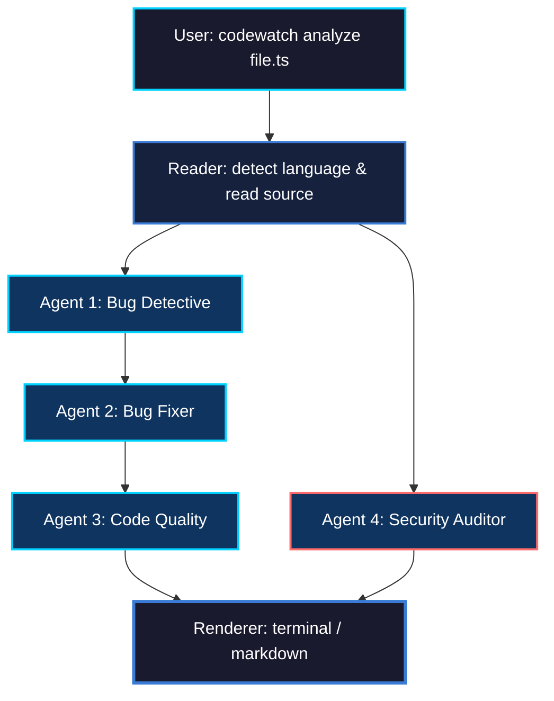
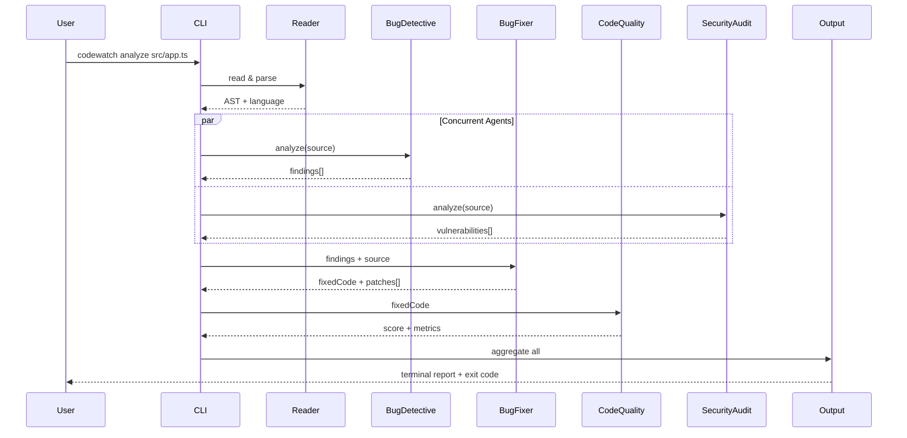

<div align="center">

<!-- Clean SVG Header — static gradient -->
<svg xmlns="http://www.w3.org/2000/svg" viewBox="0 0 800 180" width="100%">
  <defs>
    <linearGradient id="bg" x1="0%" y1="0%" x2="100%" y2="100%">
      <stop offset="0%" stop-color="#0a0a1a"/>
      <stop offset="50%" stop-color="#1a1a3e"/>
      <stop offset="100%" stop-color="#0f0c29"/>
    </linearGradient>
    <linearGradient id="text" x1="0%" y1="0%" x2="100%" y2="0%">
      <stop offset="0%" stop-color="#00d2ff"/>
      <stop offset="50%" stop-color="#3a7bd5"/>
      <stop offset="100%" stop-color="#00d2ff"/>
    </linearGradient>
    <filter id="glow">
      <feGaussianBlur stdDeviation="3" result="blur"/>
      <feMerge>
        <feMergeNode in="blur"/>
        <feMergeNode in="SourceGraphic"/>
      </feMerge>
    </filter>
  </defs>
  <rect width="800" height="180" fill="url(#bg)" rx="10"/>
  <text x="400" y="95" text-anchor="middle" font-family="-apple-system,BlinkMacSystemFont,'Segoe UI',monospace" font-size="72" font-weight="700" fill="url(#text)" filter="url(#glow)" letter-spacing="-2">FiXr</text>
  <text x="400" y="125" text-anchor="middle" font-family="-apple-system,BlinkMacSystemFont,'Segoe UI',monospace" font-size="13" fill="#888" letter-spacing="2">MULTI-AGENT CODE INTELLIGENCE</text>
  <text x="400" y="150" text-anchor="middle" font-family="-apple-system,BlinkMacSystemFont,'Segoe UI',monospace" font-size="11" fill="#555" letter-spacing="1">Core · TypeScript CLI</text>
</svg>

<br>

[](https://nodejs.org/)
[](https://www.typescriptlang.org/)
[](LICENSE)

</div>

---

## Table of Contents

- [Overview](#overview)
- [Architecture](#architecture)
  - [Agent Pipeline](#agent-pipeline)
  - [Execution Flow](#execution-flow)
- [📖 Beginner's Guide: How FiXr Works](#-beginners-guide-how-fixr-works)
  - [1. The Agent Analogy](#1-the-agent-analogy)
  - [2. How Data Flows Step-by-Step](#2-how-data-flows-step-by-step)
- [⚡ Quickstart (60-Second Setup)](#-quickstart-60-second-setup)
- [🔌 Special Focus: Setting up Groq](#-special-focus-setting-up-groq)
- [Prerequisites](#prerequisites)
- [Installation](#installation)
- [⚙️ Setup & Configuration](#️-setup--configuration)
  - [1. Interactive Setup (`codewatch init`)](#1-interactive-setup-codewatch-init)
  - [2. Environment Variables](#2-environment-variables)
  - [3. LLM Provider Configurations](#3-llm-provider-configurations)
- [🚀 CLI Commands Reference](#-cli-commands-reference)
  - [`codewatch init`](#codewatch-init)
  - [`codewatch analyze <file>`](#codewatch-analyze-file)
  - [`codewatch watch [dir]`](#codewatch-watch-dir)
  - [`codewatch diff`](#codewatch-diff)
- [🤖 Detailed Agent Cohort Specs](#-detailed-agent-cohort-specs)
  - [Agent 1: Bug Detective](#agent-1-bug-detective)
  - [Agent 2: Bug Fixer](#agent-2-bug-fixer)
  - [Agent 3: Code Quality Reviewer](#agent-3-code-quality-reviewer)
  - [Agent 4: Security Auditor](#agent-4-security-auditor)
- [🔧 Configuration File Reference](#-configuration-file-reference)
  - [Cosmiconfig Search Order](#cosmiconfig-search-order)
  - [Default Config Schema](#default-config-schema)
- [🔌 Supported Languages Matrix](#-supported-languages-matrix)
- [📁 Project Architecture & Layout](#-project-architecture--layout)
- [🔄 Rate Limit & Retry Logic](#-rate-limit--retry-logic)
- [💡 Senior Developer Workflow Integration](#-senior-developer-workflow-integration)
- [📊 Sample Outputs](#-sample-outputs)
- [❓ Beginner FAQ & Troubleshooting](#-beginner-faq--troubleshooting)
- [License](#license)

---

## Overview

**FiXr** is a terminal-first, multi-agent AI static code analysis CLI. It orchestrates a structured pipeline of four specialized LLM agents—each operating with a strict domain persona (detecting runtime bugs, writing targeted inline patches, assessing maintainability/complexity, and auditing security flaws). 

Unlike legacy linters that only print issues, **FiXr** includes an active auto-patching mechanism. It can directly modify your files on disk with comment-annotated solutions. It is designed for engineers seeking deep, context-aware code review workflows without breaking context from the shell.

> **Note:** The product name is **FiXr**. The CLI binary executable is registered as **`codewatch`** for backward compatibility.

---

## Architecture

### Agent Pipeline



**Pipeline Execution Hierarchy:**
1. **Reader**: Detects programming language based on file extension and loads file buffer into memory.
2. **Bug Detective**: Runs static analysis prompts over the raw source code to find runtime and logical bugs.
3. **Bug Fixer**: Takes the Bug Detective's findings and generates a patched version of the file. It is skipped if no bugs are found.
4. **Code Quality Reviewer**: Evaluates the code's complexity, readability, and modularity. Analyzes the *fixed code* if the Bug Fixer ran, otherwise analyzes the *original code*.
5. **Security Auditor**: Runs an independent OWASP-aligned scan on the original source code.
6. **Renderer**: Aggregates the results and prints the output (terminal color card or markdown report).

### Execution Flow



---

## 📖 Beginner's Guide: How FiXr Works

If you are new to artificial intelligence, command-line interfaces (CLIs), or code review tools, here is a breakdown of what happens under the hood when you use FiXr.

### 1. The Agent Analogy
Instead of using a single AI model to write a general review (which often leads to hallucinations or skipped lines), **FiXr divides the review among 4 specialized AI Agents**. Think of it as a virtual engineering team reviewing your code before production:

| Agent | Virtual Role | Real-world Equivalent | What it looks for |
|:---|:---|:---|:---|
| **Bug Detective** | **The QA Tester** | Checks code line-by-line | Logical flaws, off-by-one loops, undefined variables, syntax crashes. |
| **Bug Fixer** | **The Junior Developer** | Writes target code fixes | Consumes the Tester's bug list and writes the exact replacement code, adding `// FIXED:` comments. |
| **Code Quality** | **The Tech Lead** | Scores style & structure | Evaluates readability, checks if functions are too long, reviews naming consistency, scores the file (0-100). |
| **Security Auditor** | **The SecOps Specialist** | Audits credentials & safety | Scans for hardcoded credentials/secrets, SQL injections, and weak encryption. |

---

### 2. How Data Flows Step-by-Step
When you execute `codewatch analyze src/app.ts --fix`:

```
[ Your Hard Drive ] ➔ 1. Read Code ➔ 2. Send to AI (Groq/Claude) ➔ 3. Process Report
                                                                       │
[ Your Hard Drive ] ↞  5. Overwrite File  ↞ 4. Ask User ("Apply?") ↞───┘
```

1. **Local Read**: FiXr opens `src/app.ts` on your computer and automatically detects the language (TypeScript) based on the `.ts` extension.
2. **AI Processing**: FiXr wraps your code inside system instructions (prompts) and sends it securely to your chosen AI provider (e.g. Groq).
3. **Agent Sequence**: 
   - First, the **Bug Detective** and **Security Auditor** run in parallel to flag issues.
   - Next, the **Bug Fixer** receives the list of bugs and creates a corrected code snippet.
   - Finally, the **Code Quality Reviewer** grades the final output.
4. **Terminal Report**: The results are formatted using color-coded cards and emojis, and printed directly to your screen.
5. **Interactive Patching**: If the `--fix` flag was used, FiXr prompts you: `Do you want to apply these fixes? (y/n)`. If you type `y`, it updates `src/app.ts` on your hard drive with the fixed code.

---

## ⚡ Quickstart (60-Second Setup)

Follow these commands to install and verify **FiXr** on your system:

```bash
# 1. Clone the repository and install dependencies
git clone https://github.com/soumyachk101/FiXr.git
cd FiXr
npm install

# 2. Compile TypeScript and link globally to your terminal
npm run build
npm link

# 3. Initialize your workspace (Enter your API Key here)
codewatch init

# 4. Run your first code review & auto-fix session
codewatch analyze src/index.ts --fix
```

---

## 🔌 Special Focus: Setting up Groq

**Groq** is a popular AI provider known for running models (like Meta's Llama 3) at speeds of over 500 tokens per second. It is perfect for local developer environments.

### Step 1: Obtain a Groq API Key
1. Go to [console.groq.com](https://console.groq.com/) and sign up for a free account.
2. Navigate to **API Keys** in the sidebar.
3. Click **Create API Key**, name it `FiXr-CLI`, and copy the key (it starts with `gsk_`).

### Step 2: Configure FiXr to use Groq

Run the initializer command:
```bash
codewatch init
```
When prompted:
```text
🔑 Enter your LLM API Key (or press Enter for local Ollama):
```
Paste your Groq API key (`gsk_...`) and press **Enter**.

### Step 3: What FiXr Automatically Configures
FiXr detects the `gsk_` prefix and automatically configures:
- Your local `.env` file with the Groq URL:
  ```env
  OPENAI_API_KEY=gsk_...
  OPENAI_API_BASE=https://api.groq.com/openai/v1
  ```
- Your local `.codewatchrc.json` file with the default Groq model:
  ```json
  "model": "llama-3.3-70b-versatile"
  ```
- Your workspace languages by scanning your directory for file extensions.

You are now ready to run reviews using Groq's high-speed Llama models!

---

## Prerequisites

| Dependency | Minimum Version | Purpose |
|:---|:---|:---|
| [Node.js](https://nodejs.org/) | 18.0.0+ | Javascript runtime engine |
| [npm](https://npmjs.com/) | 9.0.0+ | Dependency and packages installer |
| [Git](https://git-scm.com/) | 2.0.0+ | Required for change tracking under the `diff` command |
| LLM API Key | — | Anthropic Claude, OpenAI, DeepSeek, Groq, or Ollama (Local) |

---

## Installation

```bash
# Clone the repository
git clone https://github.com/soumyachk101/FiXr.git
cd FiXr

# Install runtime dependencies
npm install

# Compile TypeScript sources
npm run build

# Link binary globally
npm link
```

Verify your installation:
```bash
codewatch --version
# Expected output: 1.0.0
```

To uninstall or unlink:
```bash
npm unlink -g codewatch
```

---

## ⚙️ Setup & Configuration

### 1. Interactive Setup (`codewatch init`)

Run the interactive setup command to configure your environment:

```bash
codewatch init
```

The initializer:
1. **Reads or Asks for API Key**: Automatically detects keys in environment variables or prompts you to enter one.
2. **Auto-detects Provider & Model**: Analyzes key prefixes to set up Anthropic, OpenAI, DeepSeek, Groq, or Ollama.
3. **Scans Project Extensions**: Crawls files in the current folder to check if it's a TypeScript, Javascript, Python, or Go project, and configures watch extensions accordingly.
4. **Writes Config Files**: Generates `.codewatchrc.json` and updates `.env`.

### 2. Environment Variables

FiXr loads environment settings from a local `.env` file in the workspace directory, or uses active shell environment variables.

| Key | Mandatory For | Description |
|:---|:---|:---|
| `ANTHROPIC_API_KEY` | Anthropic Claude models | Your Anthropic Claude API Key |
| `OPENAI_API_KEY` | OpenAI, DeepSeek, Groq, Ollama | Your API token for the selected service |
| `OPENAI_API_BASE` | DeepSeek, Groq, Ollama, Custom | Custom endpoint base URL for non-OpenAI endpoints |

---

## 🚀 CLI Commands Reference

### `codewatch init`

Automatically configures your project directory and environment settings.

```bash
codewatch init
```

---

### `codewatch analyze <path>`

Performs analysis of a single target source file or a whole directory path recursively.

```bash
codewatch analyze <file-or-directory-path> [options]
```

#### Arguments

* `<path>`: The target file path (e.g. `src/index.ts`) or directory path (e.g. `src`) to analyze. When a directory is specified, FiXr recursively scans for all files matching project extensions (excluding ignored folders).

#### Options

| Option | Short | Default | Description |
|:---|:---:|:---|:---|
| `--fix` | `-f` | — | Run the fixer agent and write the patched file directly to disk |
| `--yes` | `-y` | — | Skip confirmation prompts (auto-approves code overwrites) |
| `--output <path>`| `-o` | config | Save final report to a specific Markdown file path |
| `--agents <list>`| `-a` | config | Comma-separated active agents (subset of `bug,fixer,quality,security`) |
| `--model <model>`| `-m` | config | Model override configuration for this command instance |

#### Examples

```bash
# Full analysis pipeline run on a single file
codewatch analyze src/utils.ts

# Apply fixes directly to a file after terminal confirmation
codewatch analyze src/utils.ts --fix

# Quietly apply fixes to all files in an entire directory recursively (no prompts)
codewatch analyze src --fix --yes
```

---

### `codewatch watch [dir]`

Monitors a directory path for file modifications and triggers code reviews on save.

```bash
codewatch watch [directory-path] [options]
```

#### Examples

```bash
# Watch the current directory and use default configurations
codewatch watch

# Watch specific subdirectory using OpenAI GPT-4o
codewatch watch src/api --model gpt-4o
```

---

### `codewatch diff`

Scans and reviews files modified in the active Git tree (detects uncommitted edits).

```bash
codewatch diff [options]
```

#### Examples

```bash
# Audit changes before committing
codewatch diff

# Auto-apply patches to modified code before a commit
codewatch diff --fix --yes
```

---

## 🤖 Detailed Agent Cohort Specs

### Agent 1: Bug Detective
- **Source**: [bugDetective.ts](file:///Users/soumyachakraborty/Documents/D/NexusOp%202.0%20Node.Js%20Backend/FiXr/src/agents/bugDetective.ts)
- **Role**: Scans raw code buffers for syntax abnormalities and logic bugs.
- **Grading Schema**: `HIGH` (causes runtime failure), `MEDIUM` (conditional crashes), `LOW` (bad styling, logic smells).

### Agent 2: Bug Fixer
- **Source**: [bugFixer.ts](file:///Users/soumyachakraborty/Documents/D/NexusOp%202.0%20Node.Js%20Backend/FiXr/src/agents/bugFixer.ts)
- **Role**: Receives Detective's JSON issues list. Reconstructs file lines with corrective edits.
- **Edits Format**: Edits ONLY lines associated with identified bugs. Annotates patches with a trailing comment format: `// FIXED: <short reason>`.

### Agent 3: Code Quality Reviewer
- **Source**: [codeQuality.ts](file:///Users/soumyachakraborty/Documents/D/NexusOp%202.0%20Node.Js%20Backend/FiXr/src/agents/codeQuality.ts)
- **Role**: Assesses code readability, algorithmic complexity, architectural decomposition, and comment density.
- **Scoring Schema**: `EXCELLENT` (90-100), `GOOD` (75-89), `NEEDS_WORK` (50-74), `POOR` (0-49).

### Agent 4: Security Auditor
- **Source**: [securityAudit.ts](file:///Users/soumyachakraborty/Documents/D/NexusOp%202.0%20Node.Js%20Backend/FiXr/src/agents/securityAudit.ts)
- **Role**: Scans files for OWASP Top 10 vulnerabilities (hardcoded secrets, SQL injections, insecure cryptographic methods).

---

## 🔧 Configuration File Reference

### Cosmiconfig Search Order

FiXr searches for project settings in your workspace root, checking the following files in priority order:

1. `.codewatchrc.json`
2. `.codewatchrc.yaml` / `.codewatchrc.yml`
3. `.codewatchrc.js` / `.codewatchrc.cjs`
4. `codewatch.config.js` / `codewatch.config.cjs`
5. `codewatch` configuration block in `package.json`

### Default Config Schema

```json
{
  "agents": ["bug", "fixer", "quality", "security"],
  "ignore": ["node_modules", "dist", "*.test.js", ".git", "build", "coverage"],
  "watch": {
    "extensions": [".js", ".ts", ".py", ".go"],
    "debounce": 2000
  },
  "output": {
    "format": "terminal",
    "saveReport": false,
    "reportPath": "./reports"
  },
  "model": "claude-3-5-sonnet-20240620",
  "maxTokens": 2000
}
```

---

## 🔌 Supported Languages Matrix

* **JavaScript** (`.js`, `.jsx`, `.mjs`)
* **TypeScript** (`.ts`, `.tsx`)
* **Python** (`.py`)
* **Go** (`.go`)
* **Java** (`.java`)
* **C / C++** (`.c`, `.cpp`, `.h`)
* **Rust** (`.rs`)
* **Ruby** (`.rb`)
* **PHP** (`.php`)

---

## 📁 Project Architecture & Layout

```
FiXr/
├── dist/                             # Compiled JavaScript build output
├── src/                              # TypeScript CLI codebase
│   ├── index.ts                      # CLI entrypoint (Commander config)
│   ├── agents/                       # Agent logic
│   │   ├── types.ts                  # Shared data schemas
│   │   ├── pipeline.ts               # Pipeline orchestrator
│   │   ├── bugDetective.ts           # Agent 1 (Bug detection)
│   │   ├── bugFixer.ts               # Agent 2 (Targeted patch writer)
│   │   ├── codeQuality.ts            # Agent 3 (Maintainability evaluation)
│   │   └── securityAudit.ts          # Agent 4 (Security vulnerability scanner)
│   ├── api/                          # LLM integration
│   │   └── claude.ts                 # Unified client API wrapper
│   ├── commands/                     # Commander action modules
│   │   ├── init.ts                   # Automated workspace initializer
│   │   ├── analyze.ts                # Single-file analyzer command
│   │   ├── watch.ts                  # Directory watcher command
│   │   └── diff.ts                   # Git change tracker command
│   └── output/                       # Output format renderers
│       ├── terminal.ts               # Chalk terminal logger & ASCII logo
│       └── markdown.ts               # Markdown report compiler
```

---

## 🔄 Rate Limit & Retry Logic

To handle high-frequency calls, FiXr implements automated rate limit handling inside the API layer:
* **HTTP 429 Interception**: Detects rate-limit errors from OpenAI-compatible endpoints.
* **Auto-Delay Parsing**: Extracts requested wait time from response bodies (e.g., `try again in 2.5s`).
* **Exponential Backoff**: Falls back to doubling delays (`1s` ➔ `2s` ➔ `4s`) for a maximum of `3` retries before failing.

---

## 💡 Senior Developer Workflow Integration

### Git Pre-commit Hook Integration
Prevent bad code from being committed. Create `.husky/pre-commit`:
```bash
#!/bin/sh
. "$(dirname "$0")/_/husky.sh"

echo "🔍 Running pre-commit checks..."
codewatch diff --agents bug,security
```

### GitHub Actions Quality Gate
Add `.github/workflows/fixr.yml` to run checks on Pull Requests:
```yaml
name: Quality Gate
on: [pull_request]
jobs:
  audit:
    runs-on: ubuntu-latest
    steps:
      - uses: actions/checkout@v3
        with:
          fetch-depth: 0
      - uses: actions/setup-node@v3
        with:
          node-version: 18
      - run: npm install && npm run build && npm link
      - run: codewatch diff --agents bug,security
        env:
          ANTHROPIC_API_KEY: ${{ secrets.ANTHROPIC_API_KEY }}
```

---

## 📊 Sample Outputs

### Terminal Output Simulation

```text
  ███████╗██╗██╗  ██╗██████╗ 
  ██╔════╝██║╚██╗██╔╝██╔══██╗
  █████╗  ██║ ╚███╔╝ ██████╔╝
  ██╔══╝  ██║ ██╔██╗ ██╔══██╗
  ██║     ██║██╔╝ ██╗██║  ██║
  ╚═╝     ╚═╝╚═╝  ╚═╝╚═╝  ╚═╝
   FiXr — Multi-Agent Code Intelligence
   v1.0.0 | Static analysis, security audit & auto-patching

━━━━━━━━━━━━━━━━━━━━━━━━━━━━━━━━━━━━━━━━━━━━━━━━━━━━━━━━
  Analysis Target: src/api/payment.ts
  Language:        TypeScript
━━━━━━━━━━━━━━━━━━━━━━━━━━━━━━━━━━━━━━━━━━━━━━━━━━━━━━━━

🐛 BUG DETECTIVE
  [HIGH] Line 45 — Object 'user' is possibly 'undefined' before user.email property read (null-reference)

🔧 BUG FIXER
  Applied the following patches:
  ✔ Added optional chain checking to user.email on line 45

✨ CODE QUALITY
  Rating: GOOD (84/100)
  Suggestions for improvement:
    - [MEDIUM] Line 102: Function payInvoice is too long (45 lines)

🔒 SECURITY AUDITOR
  Overall Risk Level: HIGH
  [HIGH] Line 140 — Plaintext token logging variable detected (PII-leak)
    Desc: Secret authorization token logged to console buffer
    Fix:  Remove log expression or mask credential string patterns

━━━━━━━━━━━━━━━━━━━━━━━━━━━━━━━━━━━━━━━━━━━━━━━━━━━━━━━━
  Score: 84/100  |  Bugs: 1  |  Security Issues: 1
━━━━━━━━━━━━━━━━━━━━━━━━━━━━━━━━━━━━━━━━━━━━━━━━━━━━━━━━
```

---

## ❓ Beginner FAQ & Troubleshooting

### Q: What is an API key and where do I get it?
An API key is like a password that allows the FiXr CLI to communicate with an AI model (like Groq, Anthropic, or OpenAI). You can create key accounts for free:
- **Groq key**: [console.groq.com](https://console.groq.com)
- **Anthropic Claude key**: [console.anthropic.com](https://console.anthropic.com)
- **OpenAI key**: [platform.openai.com](https://platform.openai.com)

### Q: What does `npm link` do?
It creates a shortcut on your machine so you can run the command `codewatch` from any directory in your terminal, instead of typing `node dist/index.js` inside the project folder.

### Q: Does my code get uploaded or saved?
Your code is only sent temporarily to the LLM Provider you configured (e.g. Groq) to perform the static analysis check. It is not saved or stored by the CLI.

### Q: How do I run this tool on my other projects?
1. Open your terminal and navigate to your other project: `cd /path/to/my-other-project`.
2. Run `codewatch init` to set up the configuration file `.codewatchrc.json` for that specific project.
3. Run `codewatch analyze <filename>` to inspect your project files.

---

## License

This project is licensed under the terms of the [ISC License](LICENSE).
